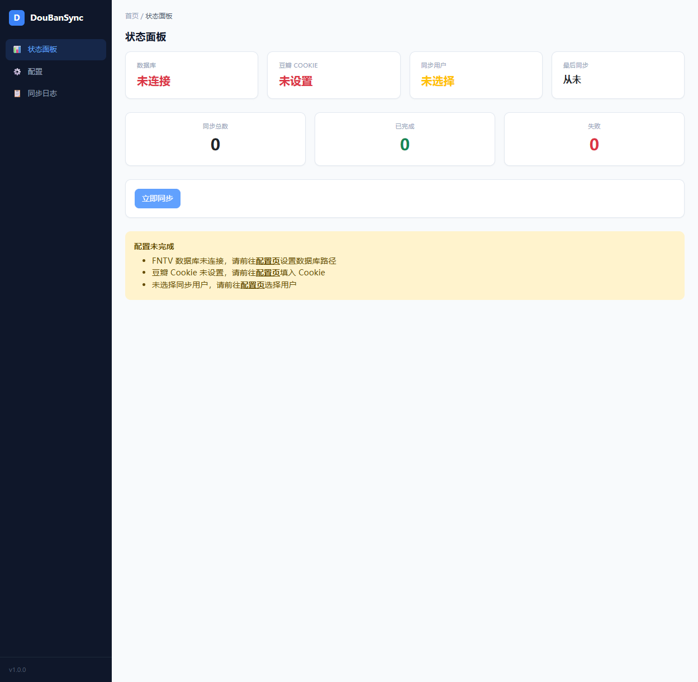
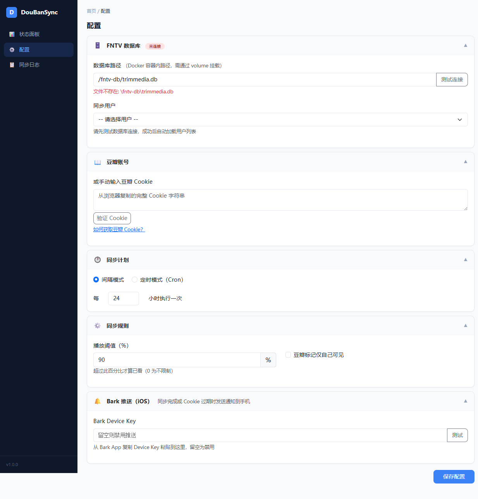
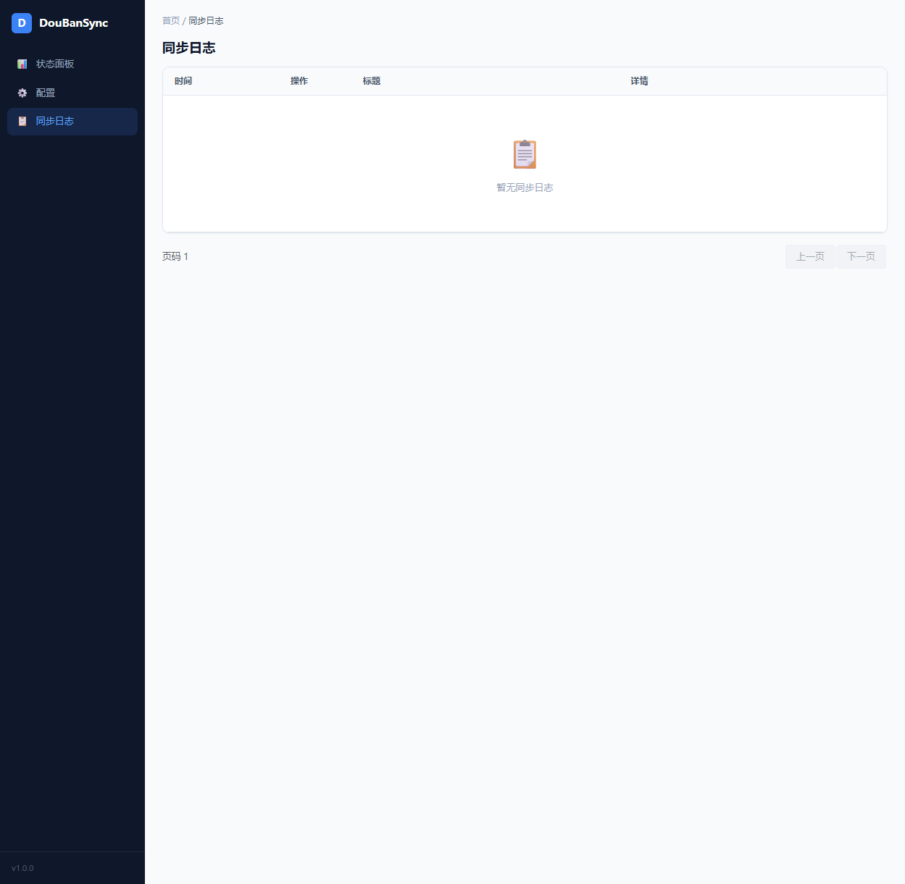

<p align="center">
  
  
  
  
</p>

<h1 align="center">🎬 DouBanSync</h1>
<h3 align="center">飞牛影视 → 豆瓣 · 观看记录自动同步工具</h3>

<p align="center">
  将 <strong>飞牛影视 (FNTV)</strong> 中的观看记录自动同步到 <strong>豆瓣书影音档案</strong>，
  让每一部看过的电影和追完的剧集都不留空白。
</p>

<br>

<p align="center">
  
</p>

---

## ✨ 功能亮点

| 特性 | 说明 |
|------|------|
| 🚀 **自动同步** | 定时读取飞牛影视播放记录，通过豆瓣 API 自动标记 |
| 🎯 **智能匹配** | 电影自动匹配、电视剧自动识别季度边界，分季正确标记 |
| 📺 **剧集状态机** | 首集 → "在看"，末集 → "看过"，中间集跳过，幂等安全 |
| 🧹 **阈值过滤** | 播放百分比门槛，避免随手点开就标记的误报 |
| ⏰ **灵活调度** | 间隔模式 / Cron 表达式，精确到你想要的每一分钟 |
| 📡 **实时日志** | 浏览器端 SSE 流式展示，每一步操作清晰可见 |
| 🔔 **Bark 推送** | 按状态推送片名、处理结果和失败原因，Cookie 过期主动告警 |
| 🐳 **一键部署** | Docker 镜像即拉即用，无需复杂环境配置 |
| 🌐 **Web 管理** | 浏览器配置页，无需编辑任何配置文件 |

---

## 🖼️ 界面预览

| 状态面板 | 配置页面 | 同步日志 |
|:---:|:---:|:---:|
| [](docs/screenshot-dashboard.png) | [](docs/screenshot-config.png) | [](docs/screenshot-history.png) |
| 同步状态一目了然，实时日志逐条展示 | 图形化配置，无需编辑文件 | 完整的历史记录与搜索 |

---

## 📋 目录

- [同步规则](#-同步规则)
- [快速开始](#-快速开始)
  - [前提条件](#前提条件)
  - [Docker 部署（推荐）](#docker-部署推荐)
  - [手动部署](#手动部署)
- [配置指南](#-配置指南)
  - [获取豆瓣 Cookie](#获取豆瓣-cookie)
  - [配置项一览](#配置项一览)
- [架构概览](#-架构概览)
- [开发指南](#-开发指南)
- [致谢](#-致谢)

---

## 📖 同步规则

<h3>🎬 电影</h3>

飞牛影视已标记「已观看」→ 直接标记「看过」；否则达到设定播放阈值（默认 90%）→ 标记「看过」。低于阈值 → 跳过。

<h3>📺 电视剧</h3>

- **首集** → 标记「在看」
- **中间集** → 跳过，不调用豆瓣 API
- **末集** → 标记「看过」
- **首次同步时所有剧集已完成** → 直接标记「看过」，不经过「在看」
- **同一集重复同步** → 跳过，不会重复标记

<h3>🧠 智能跨季匹配</h3>

当飞牛影视缺少标准季度层级时，系统通过分析集号分布自动检测季度边界（集号回退 = 新季度起点），正确匹配豆瓣的分季条目，避免跨季混淆。

---

## 🚀 快速开始

### 前提条件

- **Docker** + **Docker Compose**（推荐）
- 飞牛影视（FNTV）已正常运行
- 从浏览器提取的豆瓣 Cookie（见下方指南）

### Docker 部署（推荐）

**1. 克隆或下载项目**

```bash
git clone https://github.com/yourname/DouBanSync.git
cd DouBanSync
```

**2. 编辑 `docker-compose.yml`**

```yaml
volumes:
  # 飞牛影视数据库文件（只读），根据实际路径修改
  - /vol1/@apps/trimmedia/trimmedia.db:/fntv-db/trimmedia.db:ro
  # 持久化同步状态（自动创建）
  - ./sync_state:/app/sync_state
```

> 飞牛影视数据库通常位于飞牛 OS 的 `/usr/local/apps/@appdata/trim.media/database/trimmedia.db`，`/vol1/@apps/trimmedia/trimmedia.db` 是其符号链接。如有权限问题，请直接挂载原路径。

**3. 拉取并启动**

```bash
docker compose pull   # 拉取最新镜像
docker compose up -d  # 启动容器
```

**4. 打开浏览器配置**

访问 `http://<你的NAS-IP>:58080`，进入配置页：

1. 确认 FNTV 数据库路径（容器内路径 `/fntv-db/trimmedia.db`，挂载正确则无需修改）
2. 粘贴豆瓣 Cookie
3. 选择要同步的飞牛用户
4. 点击「保存配置」

**5. 触发同步**

返回状态面板，点击「立即同步」——右侧实时面板会逐条展示同步过程。

> 💡 **首次同步后**：系统会根据你设定的调度计划自动运行，无需手动干预。

### 手动部署

```bash
# 安装依赖
pip install -r requirements.txt

# 启动开发服务器
python -m app
```

默认监听 `http://0.0.0.0:5000`。

---

## ⚙️ 配置指南

### 获取豆瓣 Cookie

<details>
<summary>📝 点击展开详细步骤</summary>

1. 使用浏览器打开 [movie.douban.com](https://movie.douban.com/) 并登录你的账号
2. 按 **F12** 打开开发者工具，切换到 **Network（网络）** 标签页
3. 刷新页面
4. 在请求列表中找到第一个 `movie.douban.com` 的 document 类型请求
5. 在 **Request Headers** 中找到 `Cookie:` 这一行
6. **右键 → Copy Value** 复制整段 Cookie 字符串
7. 粘贴到 DouBanSync 配置页面的 Cookie 输入框中

> ⚠️ 豆瓣 Cookie 有有效期，过期后需要重新提取。应用会在遇到 403 时自动尝试刷新，但长期不活跃仍需手动更新。
</details>

### 配置项一览

| 配置 | 说明 | 默认值 |
|------|------|--------|
| **FNTV 数据库路径** | 容器内数据库文件路径 | `/fntv-db/trimmedia.db` |
| **同步用户** | 选择要同步的飞牛用户 | — |
| **豆瓣 Cookie** | 浏览器提取的完整 Cookie 字符串 | — |
| **同步计划** | 间隔模式（每 N 小时）或 Cron 表达式（带可视化构建器） | 每 6 小时 |
| **播放阈值** | 支持自定义，超过设定百分比才算已看（0 为不限制） | 90% |
| **仅自己可见** | 豆瓣标记是否仅自己可见 | 否 |
| **Bark Key** | iOS 推送设备标识，留空禁用（从 Bark App 复制） | 空 |

---

## 🏗️ 架构概览

```
┌─────────────────────────────────────────────────────┐
│                   Web UI                             │
│           (Jinja2 + Bootstrap 5)                     │
└──────────────────┬──────────────────────────────────┘
                   │ HTTP / SSE
┌──────────────────▼──────────────────────────────────┐
│                  routes.py                           │
│              (Flask Blueprint)                       │
└──────────────────┬──────────────────────────────────┘
                   │
┌──────────────────▼──────────────────────────────────┐
│              sync_engine.py                          │
│         ◄── event_bus.py (SSE 实时推送)               │
└──────┬───────────────────────────┬──────────────────┘
       │                           │
┌──────▼──────────┐     ┌─────────▼──────────┐
│   fntv_db.py    │     │  douban_client.py  │
│  (FNTV 只读层)   │     │  (豆瓣 API 封装)    │
└──────┬──────────┘     └─────────┬──────────┘
       │                          │
┌──────▼──────────┐     ┌─────────▼──────────┐
│   FNTV SQLite   │     │   豆瓣非官方 API    │
│   （只读挂载）    │     │   (Cookie 认证)     │
└─────────────────┘     └────────────────────┘

┌─────────────────────────────────────────────────────┐
│              sync_store.py → sync_state.db          │
│         (SQLite + WAL — 状态持久化)                    │
└─────────────────────────────────────────────────────┘
```

### 数据流

1. **调度器**触发同步 → `sync_engine` 启动
2. 从 **FNTV SQLite** 读取增量播放记录（只读）
3. 按规则 **分类**：电影 / 剧集
4. **搜索豆瓣**匹配条目标题
5. **标记状态**（在看 / 看过）
6. 记录结果到 **sync_state.db**
7. 全程通过 **Event Bus + SSE** 实时推送到浏览器

---

## 🛠️ 开发指南

```bash
# 克隆项目
git clone https://github.com/yourname/DouBanSync.git
cd DouBanSync

# 安装依赖
pip install -r requirements.txt

# 启动开发服务器
python -m app
```

> 开发服务器默认监听 `http://0.0.0.0:5000`。
> Docker 部署的访问地址为 `http://<你的NAS-IP>:58080`。

### 项目结构

```
DouBanSync/
├── app/                    # 应用核心
│   ├── __init__.py         # Flask 应用工厂 + 调度器
│   ├── __main__.py         # 入口点
│   ├── config.py           # 配置管理
│   ├── douban_client.py    # 豆瓣 API 封装
│   ├── event_bus.py        # 事件总线（SSE 实时日志）
│   ├── fntv_db.py          # 飞牛 SQLite 只读访问
│   ├── routes.py           # Web 路由 + API 端点
│   ├── sync_engine.py      # 同步主编排引擎
│   ├── sync_store.py       # 同步状态持久化
│   └── templates/          # 页面模板
├── sync_state/             # 运行时数据
├── config.yaml             # 默认配置
├── docker-compose.yml      # Docker 编排
├── Dockerfile              # 容器构建
├── requirements.txt        # Python 依赖
└── README.md               # 本文件
```

---

## 🤝 致谢

- [MoviePilot-Plugins / doubanwatching](https://github.com/honue/MoviePilot-Plugins/tree/main/plugins/doubanwatching) — 豆瓣 Cookie 认证与标记接口的参考实现
- [fntv-record-view](https://github.com/QiaoKes/fntv-record-view) — FNTV 数据库只读查询与播放记录分析的参考实现
- 感谢所有使用和反馈的用户 ❤️

---

<p align="center">
  <sub>Built with ❤️ for the FNTV &amp; Douban community</sub>
  <br>
  <sub>如果你喜欢这个项目，欢迎 ⭐️ Star 支持</sub>
</p>
